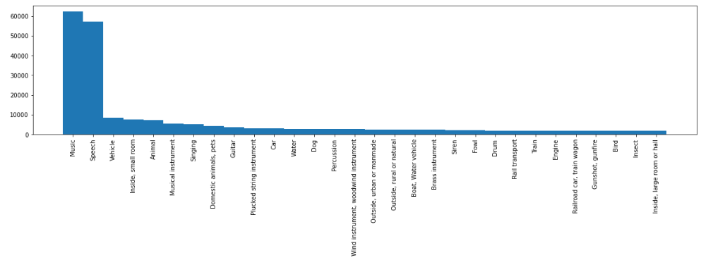
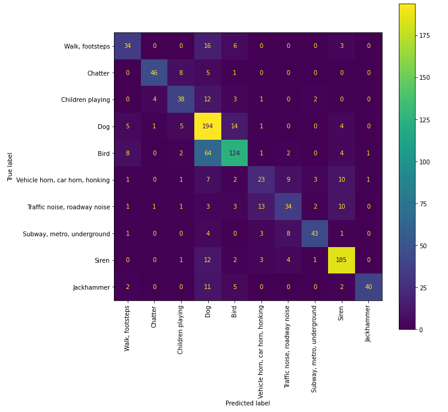
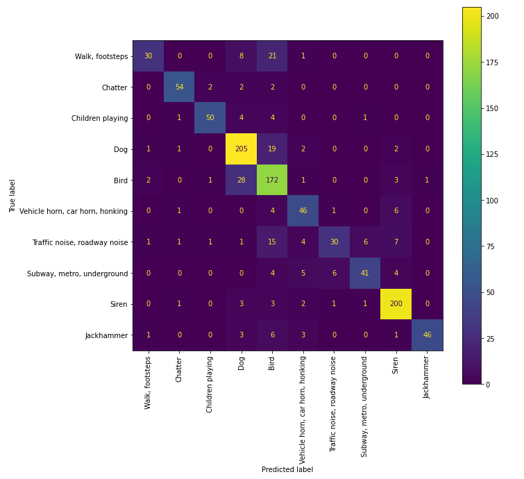
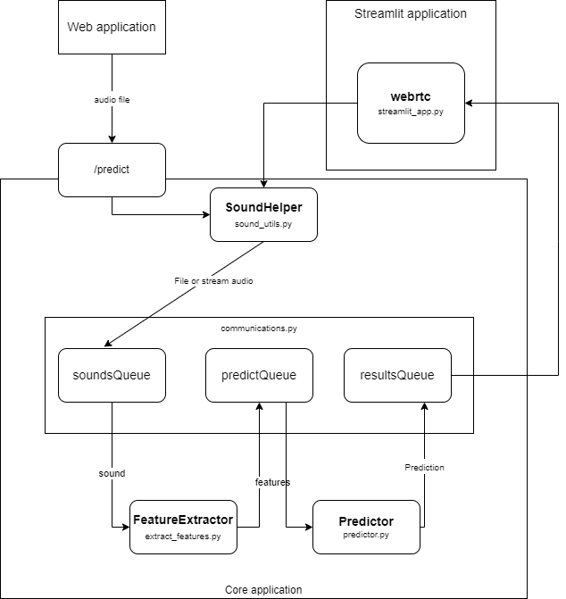

# C.U.S.T.O.M.

C.U.S.T.O.M. stands for Classifying Urban Sounds Taken On Madrid. It's a machine learning audio classifying proyect. Basically, I'm building a program that will be able to capture environmental sounds and classify them into one of the 10 labels our trained model will be able to identify.

## The dataset
We'll be using Google AudioSet dataset,[AudioSet: An ontology and human-labelled dataset for audio events](https://creativecommons.org/licenses/by-sa/4.0/) for training the different models. Also we'll use their pretrained models, [CNN Architectures for Large-Scale Audio Classification](https://research.google.com/pubs/pub45611.html).

Google's Audioset contains thousands of 10s audios (extracted from youtube videos) and 527 different classes provided as tensorflow records. After loading the balanced set records into variables and analyzing the data, these are the classes with the most number of samples:

### Classes selected
We've selected the following 10 classes to be identified by our model:

- Vehicle horn, car horn, honking
- Children playing
- Dog
- Jackhammer
- Siren
- Traffic noise, roadway noise
- Subway, metro, underground
- Walk, footsteps
- Chatter
- Bird

These are common sounds you could hear when you walk around Madrid. We'll be training our models to identify these sounds

### [Feature extraction](data_preparation/01.-%20extract_features.ipynb)
We've built a function to read all the tfrecord files and extract the audio embeddings for each of them. You can find a tfrecord exampre [here](https://research.google.com/audioset/download.html). We've saved the data using [pickle](https://docs.python.org/3/library/pickle.html) module from python for later and faster use.

## Model training
We've faced this problem from two different approaches: classic machine learning and using neural networks

### [Classic Machine Learning](data_preparation/03.-%20classic_ML_classification.ipynb)

In the previous step we saved the y truth  of every record as a binary list of 10 elements (i.e: [0 1 0 0 0 0 0 0 0 0]) which is compatible with neural networks but not with sklearn, therefore we need to tranform our 10 elements list into a value, which will be the number of the class (Audioset classes are labeled with a number, please refer to the [csv file](http://storage.googleapis.com/us_audioset/youtube_corpus/v1/csv/class_labels_indices.csv)).

As the dataset is not well balanced, we've used cross validation and StratifiedKFold strategy to split the dataset in different sets. The accuracy of the different algorithms tested is as follows:

| Algorithm                      | Accuracy mean |
| ------------------------------ | ------------: |
| SGDClassifier                  |         0.741 |
| SGDCStandarized                |         0.734 |
| LogisticRegression             |         0.756 |
| RandomForestClassifier         |         0.682 |
| ComplementNB                   |         0.681 |
| DecisionTreeClassifier         |         0.413 |
| HistGradientBoostingClassifier |         0.714 |
| SVC                            |         0.734 |
| LinearSVC                      |         0.730 |

After this first approach, we selected the best and tested with the One Vs Rest technique (OneVsRestClassifier). The results were:

| Algorithm          | Accuracy mean |
| ------------------ | ------------: |
| SGDClassifier      |         0.750 |
| SGDCStandarized    |         0.734 |
| LogisticRegression |         0.741 |
| LrStandarized      |         0.750 |
| SVC                |         0.756 |

With these results, we've gone for SVC as our main classification algorithm. We've used GridSearchCV to fine tune the algorithm's hyperparams. The confusion matrix after training our algorithm is :

Which shows the best predictions for the classes with most ocurrences but also a big number of dog sounds missclasified as birds

### [Neural Networks](data_preparation/02.-%20neural_networks_classification.ipynb)

Each audio embedding is a two dimension array, 10x128, so that must be the input of any NN we create, and the output consists on 10 nodes, one for each class. Each node will show a probability and we'll keep the highest as the class detected.

We've searched over the internet for NN specific for audio and we've tested many of them, but in the end we've only kept the results of the best of them:

| Neural network                                                                         | Accuracy |
| -------------------------------------------------------------------------------------- | -------: |
| [Keras English accent](https://keras.io/examples/audio/uk_ireland_accent_recognition/) |     0.74 |
| [qiuqiangkong](https://github.com/qiuqiangkong/audioset_classification)                |     0.82 |

In the end, we've kept this last one as our sounds classificator. It's confusion matrix shows like this:

It works better than the classic model, but it seems to have the same problem with dogs and birds

We had problems saving this model because of the custom functions defined, so we decided to save only the weights and implement the model in our code.

## Streamlit application

With our model trained, we created a web application using [Streamlit](https://streamlit.io). The application will capture audio using your computer or mobile audio and will predict the sound being recorded for every 10seconds of audio.

The module used for audio capture [streamlit_webrtc](https://github.com/whitphx/streamlit-webrtc). It provides the sound as an AudioSegment class from [pydub](https://github.com/jiaaro/pydub)

For feature extraction, we'll be using the same NN Google created for their AudioSet, [VGGish](https://github.com/tensorflow/models/tree/master/research/audioset/vggish)

### Internal structure

Streamlit is the entry point for our data source. It has two working modes:
- "wav": saves the audio as a wav file before feature extraction
- "stream": connects directly webrtc AudioSegment to 

<<<<<<< Updated upstream
## Packages needed
numpy resampy tensorflow tf_slim six soundfile
=======
## What's next?
1. Find why almost everything is a bird
2. Create an API to work with [inside shazam](https://github.com/boyander/inside-shazam)
3. Switch from AudioSet and VGGish to UrbanSounds8k (or similar) and librosa to do our own waveform analysis
4. Without VGGish weights we will be able to deploy our app to Heroku
5. Mobile app (Flutter?)  
>>>>>>> Stashed changes
