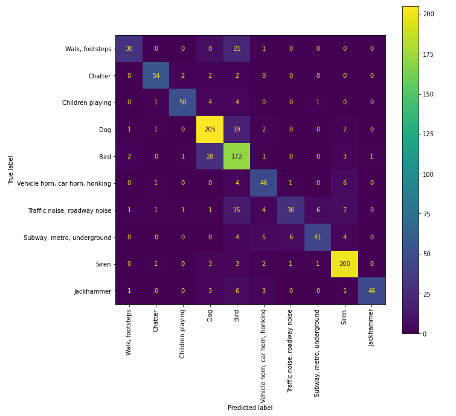

# Data cleaning :bath:
## [Feature extraction](01.-%20extract_features.ipynb)
We've built a function to read all the tfrecord files and extract the audio embeddings for each of them. You can find a tfrecord exampre [here](https://research.google.com/audioset/download.html). We've saved the data using [pickle](https://docs.python.org/3/library/pickle.html) module from python for later and faster use.

# Current status
At some point of the development, we decided to change the classes we we're going to classify, but we've preserved the analysis [below](#first-approach) as we got some valuuable information we're using now.
## Model trainig
We've left behing classic ML and we're focusing on Neural Networks.
### [Neural Networks](06.-%20Neural%20Network.ipynb)
We're using qiuqiangkong model, which looks like this:

### Training with balanced data
This is the confusion matrix (normalized) after the training:

It's working fine, but it seems to have a problem with two classes: kids and car horn.
In order to have more datapoints, we added unbalanced data, and got this confusion matrix:

We've improved in everything but child speech. It's normal, as speech is probably containing child speak samples too.

# First approach
## Model training
We've faced this problem from two different approaches: classic machine learning and using neural networks

### [Classic Machine Learning](03.-%20classic_ML_classification.ipynb)

In the previous step we saved the y truth  of every record as a binary list of 10 elements (i.e: [0 1 0 0 0 0 0 0 0 0]) which is compatible with neural networks but not with sklearn, therefore we need to tranform our 10 elements list into a value, which will be the number of the class (Audioset classes are labeled with a number, please refer to the [csv file](http://storage.googleapis.com/us_audioset/youtube_corpus/v1/csv/class_labels_indices.csv)).

As the dataset is not well balanced, we've used cross validation and StratifiedKFold strategy to split the dataset in different sets. The accuracy of the different algorithms tested is as follows:

| Algorithm                      | Accuracy mean |
| ------------------------------ | ------------: |
| SGDClassifier                  |         0.741 |
| SGDCStandarized                |         0.734 |
| LogisticRegression             |         0.756 |
| RandomForestClassifier         |         0.682 |
| ComplementNB                   |         0.681 |
| DecisionTreeClassifier         |         0.413 |
| HistGradientBoostingClassifier |         0.714 |
| SVC                            |         0.734 |
| LinearSVC                      |         0.730 |

After this first approach, we selected the best and tested with the One Vs Rest technique (OneVsRestClassifier). The results were:

| Algorithm          | Accuracy mean |
| ------------------ | ------------: |
| SGDClassifier      |         0.750 |
| SGDCStandarized    |         0.734 |
| LogisticRegression |         0.741 |
| LrStandarized      |         0.750 |
| SVC                |         0.756 |

With these results, we've gone for SVC as our main classification algorithm. We've used GridSearchCV to fine tune the algorithm's hyperparams. The confusion matrix after training our algorithm is :

Which shows the best predictions for the classes with most ocurrences but also a big number of dog sounds missclasified as birds

### [Neural Networks](02.-%20neural_networks_classification.ipynb)

Each audio embedding is a two dimension array, 10x128, so that must be the input of any NN we create, and the output consists on 10 nodes, one for each class. Each node will show a probability and we'll keep the highest as the class detected.

We've searched over the internet for NN specific for audio and we've tested many of them, but in the end we've only kept the results of the best of them:

| Neural network                                                                         | Accuracy |
| -------------------------------------------------------------------------------------- | -------: |
| [Keras English accent](https://keras.io/examples/audio/uk_ireland_accent_recognition/) |     0.74 |
| [qiuqiangkong](https://github.com/qiuqiangkong/audioset_classification)                |     0.82 |

In the end, we've kept this last one as our sounds classificator. It's confusion matrix shows like this:

It works better than the classic model, but it seems to have the same problem with dogs and birds

We had problems loading this model from disk because of the custom functions defined, so we decided to save only the weights and implement the model in our code.

